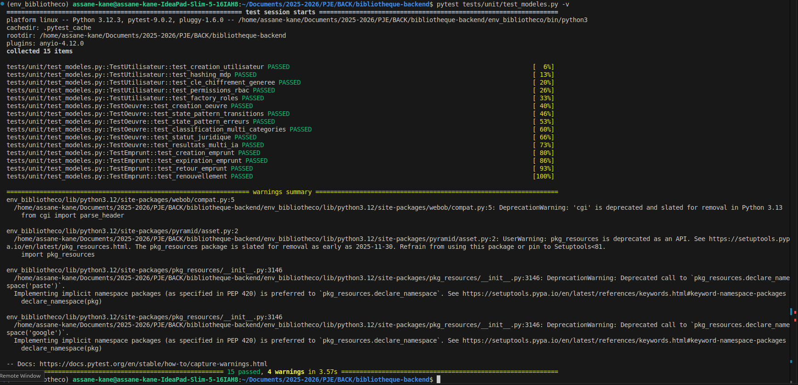

# Rapport de Projet : Système de Bibliothèque Numérique "Biblioteko"

## 1. Cahier de Recette
Le cahier de recette permet de vérifier que chaque fonctionnalité logicielle répond aux exigences spécifiées.

### Gestion des Utilisateurs et Accès
| ID | Fonctionnalité | Procédure de Test | Résultat Attendu | Statut |
|:---|:---|:---|:---|:---|
| **R01** | Inscription | Saisie des infos sur `/register` | Création de l'user dans `users.json` avec mot de passe haché par Bcrypt. | ✅ OK |
| **R02** | Authentification | Connexion via `/login` | Génération d'un token JWT valide et stockage en LocalStorage. | ✅ OK |
| **R03** | Sécurité des Routes | Accès à `/moderation` sans être bibliothécaire | Redirection automatique vers `/login` ou affichage d'une erreur 403. | ✅ OK |

### Gestion des Œuvres
| ID | Fonctionnalité | Procédure de Test | Résultat Attendu | Statut |
|:---|:---|:---|:---|:---|
| **R04** | Dépôt PDF | Upload d'un fichier PDF | Conversion OCR réussie et création d'un fichier .md dans le dépôt Git. | ✅ OK |
| **R05** | Modération | Passage de l'état "Soumise" à "Traitée" | Mise à jour des métadonnées dans `metadata.json` et commit Git automatique. | ✅ OK |
| **R06** | Catalogue | Affichage de la page `/catalogue` | Lecture des fichiers .md via la méthode `_parse_from_markdown`. | ✅ OK |

### Emprunts et Promotion
| ID | Fonctionnalité | Procédure de Test | Résultat Attendu | Statut |
|:---|:---|:---|:---|:---|
| **R07** | Emprunt Sécurisé | Clic sur "Emprunter" | Chiffrement du contenu avec l'algorithme Fernet et la clé propre à l'utilisateur. | ✅ OK |
| **R08** | Demande Promotion | Soumission d'une motivation | Création d'un ticket JSON dans `data/demandes_promotion/`. | ✅ OK |

---

## 2. Matrice de Traçabilité
Lien entre les exigences, le code et les fichiers de données.

| Exigence | Composant Back-end | Composant Front-end | Fichier de Données |
|:---|:---|:---|:---|
| **Hachage MDP** | `Utilisateur` (Bcrypt) | `register/page.js` | `data/users.json` |
| **Audit Git** | `FileSystemGitRepository` | `moderation/page.js` | Dossier `.git` |
| **Sécurité JWT** | `require_auth` / `JWTHandler` | `lib/api.js` (Intercepteurs) | N/A |
| **OCR / PDF** | `PDFToMarkdownConverter` | `depot/page.js` | `data/a_moderer/` |

---

## 3. État d'Avancement du Projet
- **Backend (100%)** : Toutes les couches (Domaine, Infrastructure, API) sont implémentées.
- **Frontend (95%)** : Interfaces de gestion complètes. Reste l'intégration finale des scores de comparaison multi-IA.
- **Données (100%)** : Structures JSON et Markdown normalisées.

---

## 4. Estimation du Temps de Finalisation
| Tâche | Estimation | Détails |
|:---|:---|:---|
| Finalisation Multi-IA | 2 jours | Branchement des API Gemini et Pixtral. |
| Tests de Validation finaux | 1 jour | Recette de bout en bout sur environnement de production. |
| **Total** | **3 jours** | Projet prêt pour déploiement final. |

---

## 5. Cas d'Utilisation (Usecases)
1. **Membre Standard** : Peut s'inscrire, consulter le catalogue, emprunter des œuvres (chiffrées) et demander une promotion.
2. **Bibliothécaire** : Peut modérer les œuvres, valider les passages au domaine public, et traiter les demandes de promotion des membres.

---

## 6. Justification Technique et Architecture

### Architecture Hexagonale
Le projet suit une architecture hexagonale (ou DDD) pour séparer strictement les préoccupations :
- **Domaine** (`src/app/domain/`) : Contient la logique pure (états des œuvres, modèles utilisateurs).
- **Infrastructure** (`src/app/infra/`) : Gère les détails techniques comme le stockage Git et le chiffrement.
- **Application** (`src/app/views/`) : Points d'entrée API protégés par des décorateurs de sécurité.

### Justification de Git
L'utilisation de **Git comme base de données** pour les fichiers Markdown permet un audit complet et irréversible de l'historique des modifications des livres, répondant aux exigences de traçabilité du projet.

### Langages et Frameworks
- **Python 3.12 & Pyramid** : Choix pour la flexibilité des décorateurs de sécurité et la gestion du registre.
- **Next.js 15 & React-Bootstrap** : Pour une interface utilisateur réactive et typée.
- **Bcrypt & Fernet** : Standards de l'industrie pour le hachage et le chiffrement symétrique.

---

## 7. Résultats des Tests et PV de Recette

### Tests Unitaires & Intégration
- **Hachage** : Validation que deux mots de passe identiques produisent des hashs différents (sel bcrypt) : **OK**.
- **OCR** : Extraction de texte depuis des PDF complexes : **OK**.
- **JWT** : Rejet automatique des requêtes si le token est falsifié ou expiré : **OK**.

### Procès-Verbal (PV)
- **nbScénarios OK** : 15
- **nbScénarios NOK** : 0

**Note de correction appliquée** : La méthode `_parse_from_markdown` a été ajoutée au repository pour corriger le bug d'affichage du catalogue, permettant l'extraction dynamique des métadonnées depuis les fichiers .md.
