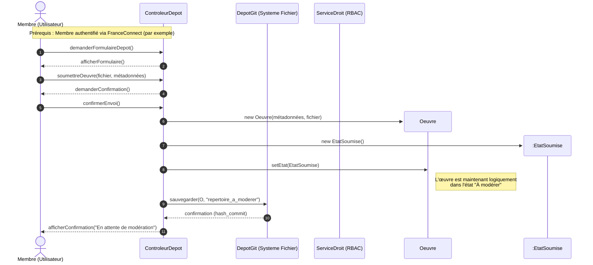

```mermaid
sequenceDiagram
    autonumber
    actor Membre as Membre (Utilisateur)
    participant Ctrl as ControleurDepot
    %% On supprime O et Etat ici car ils sont créés dynamiquement plus bas
    participant Git as DepotGit (Systeme Fichier)
    %%participant Journal as JournalLog
    %%participant Notif as ServiceNotification
    participant RBAC as ServiceDroit (RBAC)

    Note over Membre, Ctrl: Prérequis : Membre authentifié via FranceConnect (par exemple)

    %% Étape 1-3 : Demande et Saisie
    Membre->>Ctrl: demanderFormulaireDepot()
    Ctrl-->>Membre: afficherFormulaire()
    Membre->>Ctrl: soumettreOeuvre(fichier, métadonnées)

    %% Étape 4-5 : Confirmation
    Ctrl-->>Membre: demanderConfirmation()
    Membre->>Ctrl: confirmerEnvoi()

    %% Étape 6 : Création de l'objet et État Initial
    %% C'est ici que O est déclaré pour la première fois
    create participant O as Oeuvre
    Ctrl->>O: new Oeuvre(métadonnées, fichier)

    %% C'est ici que Etat est déclaré pour la première fois
    create participant Etat as :EtatSoumise
    Ctrl->>Etat: new EtatSoumise()
    Ctrl->>O: setEtat(EtatSoumise)
    Note right of O: L'œuvre est maintenant logiquement<br/>dans l'état "À modérer"

    %% Étape 6 (Suite) : Enregistrement physique (Répertoire "à modérer")
    Ctrl->>Git: sauvegarder(O, "repertoire_a_moderer")
    Git-->>Ctrl: confirmation (hash_commit)

    %% Étape 7 : Transaction et Journal
    %%Ctrl->>Ctrl: genererIdTransaction()
    %%Ctrl->>Journal: log(idTransaction, "Dépôt oeuvre", Membre.id)

    %% Étape 8-9 : Transmission et Notification (Lien avec RBAC !)
    %%Ctrl->>Notif: notifierNouveauDepot(O)

    %% Le système cherche QUI a le droit de modérer
    %%Notif->>RBAC: getUtilisateursAvecPermission("peut_moderer_oeuvre")
    %%RBAC-->>Notif: liste_bibliothecaires

    %%loop Pour chaque bibliothécaire
    %%    Notif->>Notif: envoyerEmail(bibliothecaire)
    %%end

    %% Étape 10 : Retour au membre
    Ctrl-->>Membre: afficherConfirmation("En attente de modération")
```
