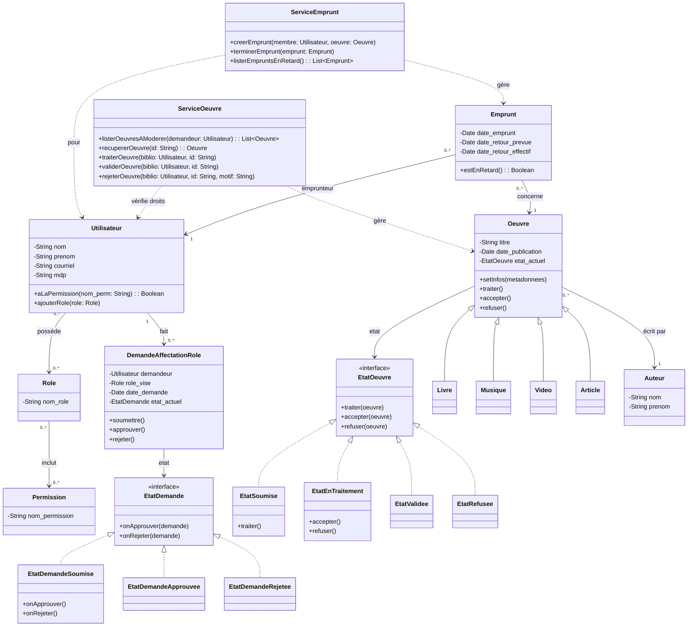

```mermaid
classDiagram
    %% ============================================================
    %% 1. COUCHE DE SERVICE (Point d'entrée)
    %% ============================================================
    class ServiceOeuvre {
        +listerOeuvresAModerer(demandeur: Utilisateur) : List~Oeuvre~
        +recupererOeuvre(id: String) : Oeuvre
        +traiterOeuvre(biblio: Utilisateur, id: String)
        +validerOeuvre(biblio: Utilisateur, id: String)
        +rejeterOeuvre(biblio: Utilisateur, id: String, motif: String)
    }

    class ServiceEmprunt {
        +creerEmprunt(membre: Utilisateur, oeuvre: Oeuvre)
        +terminerEmprunt(emprunt: Emprunt)
        +listerEmpruntsEnRetard() : List~Emprunt~
    }

    %% ============================================================
    %% 2. GESTION DES UTILISATEURS & DROITS (RBAC + State)
    %% ============================================================
    class Utilisateur {
        -String nom
        -String prenom
        -String courriel
        -String mdp
        +aLaPermission(nom_perm: String) : Boolean
        +ajouterRole(role: Role)
    }

    class Role {
        -String nom_role
    }

    class Permission {
        -String nom_permission
    }

    %% --- Pattern State pour devenir Bibliothécaire ---
    class DemandeAffectationRole {
        -Utilisateur demandeur
        -Role role_vise
        -Date date_demande
        -EtatDemande etat_actuel
        +soumettre()
        +approuver()
        +rejeter()
    }

    class EtatDemande {
        <<interface>>
        +onApprouver(demande)
        +onRejeter(demande)
    }
    class EtatDemandeSoumise {
        +onApprouver()
        +onRejeter()
    }
    class EtatDemandeApprouvee {}
    class EtatDemandeRejetee {}

    %% ============================================================
    %% 3. DOMAINE MÉTIER : LES ŒUVRES (Pattern State)
    %% ============================================================
    class Oeuvre {
        -String titre
        -Date date_publication
        -EtatOeuvre etat_actuel
        +setInfos(metadonnees)
        +traiter()
        +accepter()
        +refuser()
    }

    class EtatOeuvre {
        <<interface>>
        +traiter(oeuvre)
        +accepter(oeuvre)
        +refuser(oeuvre)
    }
    class EtatSoumise {
        +traiter()
    }
    class EtatEnTraitement {
        +accepter()
        +refuser()
    }
    class EtatValidee {}
    class EtatRefusee {}

    %% --- Héritage des types d'œuvres ---
    class Livre {}
    class Musique {}
    class Video {}
    class Article {}

    class Auteur {
        -String nom
        -String prenom
    }

    %% ============================================================
    %% 4. DOMAINE MÉTIER : LES EMPRUNTS
    %% ============================================================
    class Emprunt {
        -Date date_emprunt
        -Date date_retour_prevue
        -Date date_retour_effectif
        +estEnRetard() : Boolean
    }

    %% ============================================================
    %% RELATIONS
    %% ============================================================

    %% RBAC
    Utilisateur "0..*" --> "0..*" Role : possède
    Role "0..*" --> "0..*" Permission : inclut

    %% Demande de Role
    Utilisateur "1" --> "0..*" DemandeAffectationRole : fait
    DemandeAffectationRole --> EtatDemande : etat
    EtatDemande <|.. EtatDemandeSoumise
    EtatDemande <|.. EtatDemandeApprouvee
    EtatDemande <|.. EtatDemandeRejetee

    %% Oeuvres & State
    Oeuvre --> EtatOeuvre : etat
    EtatOeuvre <|.. EtatSoumise
    EtatOeuvre <|.. EtatEnTraitement
    EtatOeuvre <|.. EtatValidee
    EtatOeuvre <|.. EtatRefusee

    %% Héritage Oeuvres
    Oeuvre <|-- Livre
    Oeuvre <|-- Musique
    Oeuvre <|-- Video
    Oeuvre <|-- Article

    %% Auteurs & Emprunts
    Oeuvre "0..*" --> "1" Auteur : écrit par
    Emprunt "0..*" --> "1" Utilisateur : emprunteur
    Emprunt "0..*" --> "1" Oeuvre : concerne

    %% Services (Dépendances)
    ServiceOeuvre ..> Utilisateur : vérifie droits
    ServiceOeuvre ..> Oeuvre : gère
    ServiceEmprunt ..> Emprunt : gère
    ServiceEmprunt ..> Utilisateur : pour

```
