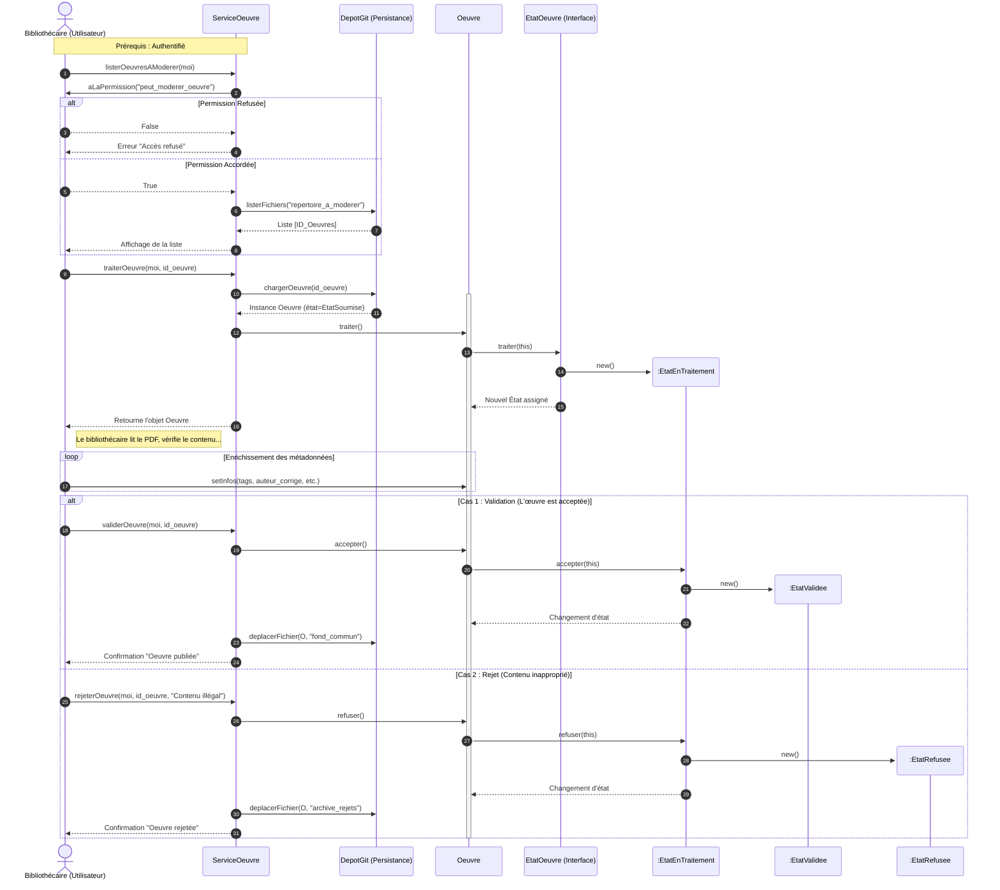

```mermaid
sequenceDiagram
    autonumber
    actor Biblio as Bibliothécaire (Utilisateur)
    participant Service as ServiceOeuvre
    participant Git as DepotGit (Persistance)
    participant O as Oeuvre
    participant Etat as EtatOeuvre (Interface)

    Note over Biblio, Service: Prérequis : Authentifié

    %% ============================================================
    %% ÉTAPE 1 : LISTING ET VÉRIFICATION DES DROITS
    %% ============================================================
    Biblio->>Service: listerOeuvresAModerer(moi)

    %% Le Service demande à l'objet Utilisateur s'il a la permission (RBAC)
    Service->>Biblio: aLaPermission("peut_moderer_oeuvre")

    alt Permission Refusée
        Biblio-->>Service: False
        Service-->>Biblio: Erreur "Accès refusé"
    else Permission Accordée
        Biblio-->>Service: True
        Service->>Git: listerFichiers("repertoire_a_moderer")
        Git-->>Service: Liste [ID_Oeuvres]
        Service-->>Biblio: Affichage de la liste
    end

    %% ============================================================
    %% ÉTAPE 2 : PRISE EN CHARGE (VERROUILLAGE)
    %% ============================================================
    Biblio->>Service: traiterOeuvre(moi, id_oeuvre)

    %% Chargement de l'objet
    Service->>Git: chargerOeuvre(id_oeuvre)
    activate O
    Git-->>Service: Instance Oeuvre (état=EtatSoumise)

    %% Transition d'état : Soumise -> EnTraitement
    Service->>O: traiter()
    O->>Etat: traiter(this)

    create participant EtatTraitement as :EtatEnTraitement
    Etat->>EtatTraitement: new()
    Etat-->>O: Nouvel État assigné

    Service-->>Biblio: Retourne l'objet Oeuvre

    %% ============================================================
    %% ÉTAPE 3 : ANALYSE ET ENRICHISSEMENT
    %% ============================================================
    Note right of Biblio: Le bibliothécaire lit le PDF, vérifie le contenu...

    loop Enrichissement des métadonnées
        Biblio->>O: setInfos(tags, auteur_corrige, etc.)
        %% Ces modifications sont en mémoire sur l'objet O
    end

    %% ============================================================
    %% ÉTAPE 4 : DÉCISION FINALE
    %% ============================================================
    alt Cas 1 : Validation (L'œuvre est acceptée)
        Biblio->>Service: validerOeuvre(moi, id_oeuvre)

        %% Logique métier (Pattern State)
        Service->>O: accepter()
        O->>EtatTraitement: accepter(this)

        create participant EtatValide as :EtatValidee
        EtatTraitement->>EtatValide: new()
        EtatTraitement-->>O: Changement d'état

        %% Logique Infrastructure (Déplacement physique)
        Service->>Git: deplacerFichier(O, "fond_commun")
        %%Service->>Service: notifierAuteur(O.auteur, "Validé")
        Service-->>Biblio: Confirmation "Oeuvre publiée"

    else Cas 2 : Rejet (Contenu inapproprié)
        Biblio->>Service: rejeterOeuvre(moi, id_oeuvre, "Contenu illégal")

        %% Logique métier
        Service->>O: refuser()
        O->>EtatTraitement: refuser(this)

        create participant EtatRefuse as :EtatRefusee
        EtatTraitement->>EtatRefuse: new()
        EtatTraitement-->>O: Changement d'état

        %% Logique Infrastructure
        Service->>Git: deplacerFichier(O, "archive_rejets")
        %%Service->>Service: notifierAuteur(O.auteur, "Rejeté: Contenu illégal")
        Service-->>Biblio: Confirmation "Oeuvre rejetée"
    end
    deactivate O
```
