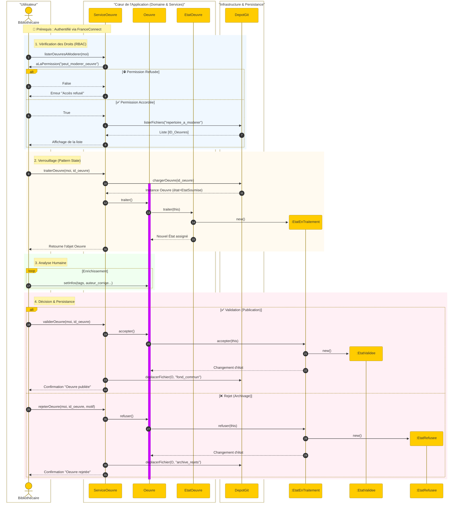

```mermaid
sequenceDiagram
    %% --- CONFIGURATION DU THEME ---
    %%{init: {'theme': 'base', 'themeVariables': { 'primaryColor': '#ffcc00', 'edgeLabelBackground':'#fff', 'actorBkg':'#ffcc00', 'signalColor': '#333', 'sequenceNumberColor': '#fff'} } }%%

    autonumber

    %% --- DÉFINITION DES GROUPES (BOX) ---
    box "Utilisateur" #fffdf5
        actor Biblio as Bibliothécaire
    end

    box "Cœur de l'Application (Domaine & Services)" #e1f5fe
        participant Service as ServiceOeuvre
        participant O as Oeuvre
        participant Etat as EtatOeuvre
    end

    box "Infrastructure & Persistance" #f3e5f5
        participant Git as DepotGit
    end

    Note over Biblio, Service: 🔐 Prérequis : Authentifié via FranceConnect

    %% ============================================================
    %% ÉTAPE 1 : VISUALISATION SOUS FORME DE BLOC COLORÉ
    %% ============================================================
    rect rgb(240, 248, 255)
        note right of Biblio: 1. Vérification des Droits (RBAC)
        Biblio->>Service: listerOeuvresAModerer(moi)

        Service->>Biblio: aLaPermission("peut_moderer_oeuvre")

        alt ⛔ Permission Refusée
            Biblio-->>Service: False
            Service-->>Biblio: Erreur "Accès refusé"
        else ✅ Permission Accordée
            Biblio-->>Service: True
            Service->>Git: listerFichiers("repertoire_a_moderer")
            Git-->>Service: Liste [ID_Oeuvres]
            Service-->>Biblio: Affichage de la liste
        end
    end

    %% ============================================================
    %% ÉTAPE 2 : PRISE EN CHARGE
    %% ============================================================
    rect rgb(255, 250, 240)
        note right of Biblio: 2. Verrouillage (Pattern State)
        Biblio->>Service: traiterOeuvre(moi, id_oeuvre)

        Service->>Git: chargerOeuvre(id_oeuvre)
        activate O
        Git-->>Service: Instance Oeuvre (état=EtatSoumise)

        Service->>O: traiter()
        O->>Etat: traiter(this)

        create participant EtatTraitement as :EtatEnTraitement
        Etat->>EtatTraitement: new()
        Etat-->>O: Nouvel État assigné

        Service-->>Biblio: Retourne l'objet Oeuvre
    end

    %% ============================================================
    %% ÉTAPE 3 : ANALYSE
    %% ============================================================
    rect rgb(240, 255, 240)
        note right of Biblio: 3. Analyse Humaine
        loop Enrichissement
            Biblio->>O: setInfos(tags, auteur_corrige...)
        end
    end

    %% ============================================================
    %% ÉTAPE 4 : DÉCISION
    %% ============================================================
    rect rgb(255, 240, 245)
        note right of Biblio: 4. Décision & Persistance
        alt ✅ Validation (Publication)
            Biblio->>Service: validerOeuvre(moi, id_oeuvre)

            Service->>O: accepter()
            O->>EtatTraitement: accepter(this)

            create participant EtatValide as :EtatValidee
            EtatTraitement->>EtatValide: new()
            EtatTraitement-->>O: Changement d'état

            Service->>Git: deplacerFichier(O, "fond_commun")
            Service-->>Biblio: Confirmation "Oeuvre publiée"

        else ❌ Rejet (Archivage)
            Biblio->>Service: rejeterOeuvre(moi, id_oeuvre, motif)

            Service->>O: refuser()
            O->>EtatTraitement: refuser(this)

            create participant EtatRefuse as :EtatRefusee
            EtatTraitement->>EtatRefuse: new()
            EtatTraitement-->>O: Changement d'état

            Service->>Git: deplacerFichier(O, "archive_rejets")
            Service-->>Biblio: Confirmation "Oeuvre rejetée"
        end
    end
    deactivate O
```
