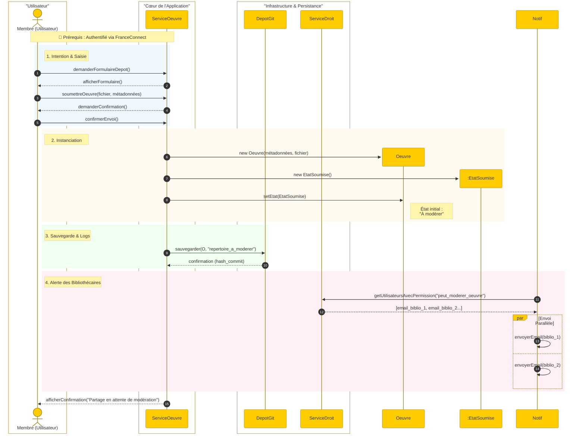

```mermaid
sequenceDiagram
    %% --- THEME IDENTIQUE AU PRÉCÉDENT ---
    %%{init: {'theme': 'base', 'themeVariables': { 'primaryColor': '#ffcc00', 'edgeLabelBackground':'#fff', 'actorBkg':'#ffcc00', 'signalColor': '#333', 'sequenceNumberColor': '#fff'} } }%%

    autonumber

    %% --- GROUPES ARCHITECTURAUX ---
    box "Utilisateur" #fffdf5
        actor Membre as Membre (Utilisateur)
    end

    box "Cœur de l'Application" #e1f5fe
        participant Service as ServiceOeuvre
        %% Les participants O et Etat seront créés dynamiquement ici
        %%participant Notif as ServiceNotification
    end

    box "Infrastructure & Persistance" #f3e5f5
        participant Git as DepotGit
        %%participant Journal as JournalLog
        participant RBAC as ServiceDroit
    end

    Note over Membre, Service: 🔐 Prérequis : Authentifié via FranceConnect

    %% ============================================================
    %% PHASE 1 : SAISIE ET CONFIRMATION
    %% ============================================================
    rect rgb(240, 248, 255)
        note right of Membre: 1. Intention & Saisie
        Membre->>Service: demanderFormulaireDepot()
        Service-->>Membre: afficherFormulaire()

        Membre->>Service: soumettreOeuvre(fichier, métadonnées)

        Service-->>Membre: demanderConfirmation()
        Membre->>Service: confirmerEnvoi()
    end

    %% ============================================================
    %% PHASE 2 : CRÉATION MÉTIER (PATTERN STATE)
    %% ============================================================
    rect rgb(255, 250, 240)
        note right of Membre: 2. Instanciation

        %% Création dynamique de l'Oeuvre
        create participant O as Oeuvre
        Service->>O: new Oeuvre(métadonnées, fichier)

        %% Initialisation du State
        create participant Etat as :EtatSoumise
        Service->>Etat: new EtatSoumise()
        Service->>O: setEtat(EtatSoumise)
        Note right of O: État initial :<br/>"À modérer"
    end

    %% ============================================================
    %% PHASE 3 : PERSISTANCE ET TRACABILITÉ
    %% ============================================================
    rect rgb(240, 255, 240)
        note right of Membre: 3. Sauvegarde & Logs

        Service->>Git: sauvegarder(O, "repertoire_a_moderer")
        Git-->>Service: confirmation (hash_commit)

        %%Service->>Journal: log(id_transac, "Dépôt oeuvre", Membre.id)
    end

    %% ============================================================
    %% PHASE 4 : NOTIFICATION (ASYNC)
    %% ============================================================
    rect rgb(255, 240, 245)
        note right of Membre: 4. Alerte des Bibliothécaires

        %%Service->>Notif: notifierNouveauDepot(O)

        %% Le système cherche QUI a le droit (RBAC)
        Notif->>RBAC: getUtilisateursAvecPermission("peut_moderer_oeuvre")
        RBAC-->>Notif: [email_biblio_1, email_biblio_2...]

        par Envoi Parallèle
            Notif->>Notif: envoyerEmail(biblio_1)
            and
            Notif->>Notif: envoyerEmail(biblio_2)
        end
    end

    %% ============================================================
    %% FIN DU SCÉNARIO
    %% ============================================================
    Service-->>Membre: afficherConfirmation("Partage en attente de modération")
```
