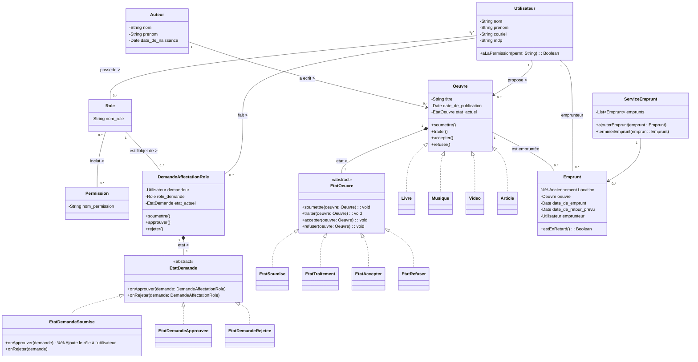

```mermaid
classDiagram
%% --- Partie Utilisateurs et Rôles (RBAC) ---
    class Utilisateur {
        -String nom
        -String prenom
        -String couriel
        -String mdp
        +aLaPermission(perm: String) : Boolean
    }

    class Role {
        -String nom_role
    }

    class Permission {
        -String nom_permission
    }

    Utilisateur "0..*" -- "0..*" Role : possede >
    Role "0..*" -- "0..*" Permission : inclut >
    %% Ex: Role "Bibliothecaire" inclut Permission "peut_moderer_oeuvre"

%% --- Partie Demande de Rôle (Pattern State 1) ---
    class DemandeAffectationRole {
        -Utilisateur demandeur
        -Role role_demande
        -EtatDemande etat_actuel
        +soumettre()
        +approuver()
        +rejeter()
    }

    class EtatDemande {
        <<abstract>>
        +onApprouver(demande: DemandeAffectationRole)
        +onRejeter(demande: DemandeAffectationRole)
    }
    class EtatDemandeSoumise {
        +onApprouver(demande) %% Ajoute le rôle à l'utilisateur
        +onRejeter(demande)
    }
    class EtatDemandeApprouvee {}
    class EtatDemandeRejetee {}

    DemandeAffectationRole "1" *-- "1" EtatDemande : etat >
    EtatDemande <|.. EtatDemandeSoumise
    EtatDemande <|.. EtatDemandeApprouvee
    EtatDemande <|.. EtatDemandeRejetee

    Utilisateur "1" -- "0..*" DemandeAffectationRole : fait >
    Role "1" -- "0..*" DemandeAffectationRole : est l'objet de >

%% --- Partie Oeuvres et Modération (Pattern State 2) ---
    class Oeuvre {
        -String titre
        -Date date_de_publication
        -EtatOeuvre etat_actuel
        +soumettre()
        +traiter()
        +accepter()
        +refuser()
    }

    class EtatOeuvre {
        <<abstract>>
        +soumettre(oeuvre: Oeuvre) : void
        +traiter(oeuvre: Oeuvre) : void
        +accepter(oeuvre: Oeuvre) : void
        +refuser(oeuvre: Oeuvre) : void
    }
    class EtatSoumise {}
    class EtatTraitement {}
    class EtatAccepter {}
    class EtatRefuser {}

    Oeuvre "1" *-- "1" EtatOeuvre : etat >
    EtatOeuvre <|.. EtatSoumise
    EtatOeuvre <|.. EtatTraitement
    EtatOeuvre <|.. EtatAccepter
    EtatOeuvre <|.. EtatRefuser

    Utilisateur "1" --> "0..*" Oeuvre : propose >
    %% La modération est gérée par un Utilisateur
    %% ayant la Permission "peut_moderer_oeuvre"

%% --- Hiérarchie des Oeuvres ---
    class Livre {}
    class Musique {}
    class Video {}
    class Article {}

    Oeuvre <|.. Musique
    Oeuvre <|.. Livre
    Oeuvre <|.. Video
    Oeuvre <|.. Article

%% --- Auteurs et Emprunts ---
    class Auteur {
        -String nom
        -String prenom
        -Date date_de_naissance
    }

    class Emprunt { %% Anciennement Location
        -Oeuvre oeuvre
        -Date date_de_emprunt
        -Date date_de_retour_prevu
        -Utilisateur emprunteur
        +estEnRetard() : Boolean
    }

    class ServiceEmprunt {
        -List~Emprunt~ emprunts
        +ajouterEmprunt(emprunt : Emprunt)
        +terminerEmprunt(emprunt : Emprunt)
    }

    Auteur "1" --> "0..*" Oeuvre : a ecrit >
    ServiceEmprunt "1" --> "0..*" Emprunt
    Utilisateur "1" -- "0..*" Emprunt : emprunteur
    Oeuvre "1" -- "0..*" Emprunt : est empruntée
```
