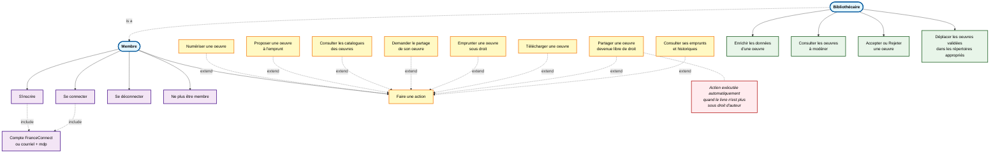

```mermaid
graph TB
    %% Define actors
    Membre([" Membre"])
    Bibliothecaire([" Bibliothécaire"])

    %% Authentication use cases
    Inscrire["S'inscrire"]
    Connecter["Se connecter"]
    Deconnecter["Se déconnecter"]
    PlusMembre["Ne plus être membre"]
    FranceConnect["Compte FranceConnect<br/>ou courriel + mdp"]

    %% Member action use cases
    FaireAction["Faire une action"]
    Numeriser["Numériser une oeuvre"]
    ProposerEmprunt["Proposer une oeuvre<br/>à l'emprunt"]
    ConsulterCatalogues["Consulter les catalogues<br/>des oeuvres"]
    DemanderPartage["Demander le partage<br/>de son oeuvre"]
    EmprunterOeuvre["Emprunter une oeuvre<br/>sous droit"]
    Telecharger["Télécharger une oeuvre"]
    PartagerLibre["Partager une oeuvre<br/>devenue libre de droit"]
    ConsulterEmprunts["Consulter ses emprunts<br/>et historiques"]

    %% Librarian use cases
    EnrichirDonnees["Enrichir les données<br/>d'une oeuvre"]
    ConsulterModeration["Consulter les oeuvres<br/>à modérer"]
    AccepterRejeter["Accepter ou Rejeter<br/>une oeuvre"]
    DeplacerOeuvres["Déplacer les oeuvres validées<br/>dans les répertoires appropriés"]

    %% Note
    Note[" Action exécutée automatiquement<br/>quand le livre n'est plus<br/>sous droit d'auteur"]

    %% Actor relationships - Authentication
    Membre --> Inscrire
    Membre --> Connecter
    Membre --> Deconnecter
    Membre --> PlusMembre

    Inscrire -.->|include| FranceConnect
    Connecter -.->|include| FranceConnect

    %% Actor relationships - Member actions
    Membre --> FaireAction

    Numeriser -.->|extend| FaireAction
    ProposerEmprunt -.->|extend| FaireAction
    ConsulterCatalogues -.->|extend| FaireAction
    DemanderPartage -.->|extend| FaireAction
    EmprunterOeuvre -.->|extend| FaireAction
    Telecharger -.->|extend| FaireAction
    PartagerLibre -.->|extend| FaireAction
    ConsulterEmprunts -.->|extend| FaireAction

    %% Actor relationships - Librarian
    Bibliothecaire --> EnrichirDonnees
    Bibliothecaire --> ConsulterModeration
    Bibliothecaire --> AccepterRejeter
    Bibliothecaire --> DeplacerOeuvres

    %% Inheritance
    Bibliothecaire -.->|is a| Membre

    %% Note connection
    PartagerLibre -.- Note

    %% Styling
    classDef actorStyle fill:#e1f5ff,stroke:#01579b,stroke-width:3px,color:#000,font-weight:bold
    classDef authStyle fill:#f3e5f5,stroke:#4a148c,stroke-width:2px,color:#000
    classDef actionStyle fill:#fff9c4,stroke:#f57f17,stroke-width:2px,color:#000
    classDef librarianStyle fill:#e8f5e9,stroke:#1b5e20,stroke-width:2px,color:#000
    classDef noteStyle fill:#ffebee,stroke:#b71c1c,stroke-width:2px,color:#000,font-style:italic

    class Membre,Bibliothecaire actorStyle
    class Inscrire,Connecter,Deconnecter,PlusMembre,FranceConnect authStyle
    class FaireAction,Numeriser,ProposerEmprunt,ConsulterCatalogues,DemanderPartage,EmprunterOeuvre,Telecharger,PartagerLibre,ConsulterEmprunts actionStyle
    class EnrichirDonnees,ConsulterModeration,AccepterRejeter,DeplacerOeuvres librarianStyle
    class Note noteStyle
```
